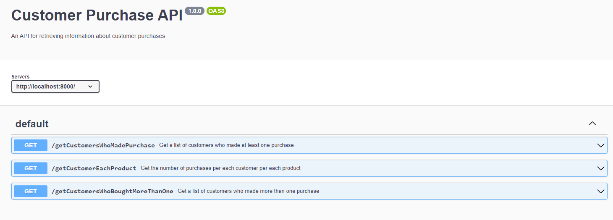

## CheckIt Technical Test

## Getting Started 
To start the docker container which runs the main application code, enter the command `docker build -t checkit-tech-test .` 

To run it on localhost:8000, enter the command `docker run -p 8000:8000 checkit-tech-test`

To see all the tests that are passing, exit the docker container and enter the command `npm test` in the terminal to view all the tests passing

To see the Open API documentation, go to the url `localhost:8000/api-docs` which will show the documentation of the following endpoints

1) `/getCustomersWhoMadePurchase` - gets a list of customers who made atleast one purchase
2) `/getCustomerEachProduct` - get the number of purchases per each customer per each product
3) `/getCustomersWhoBoughtMoreThanOne` - gets a list of customers who made more than one purchase

